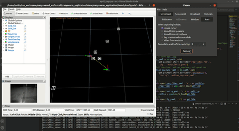
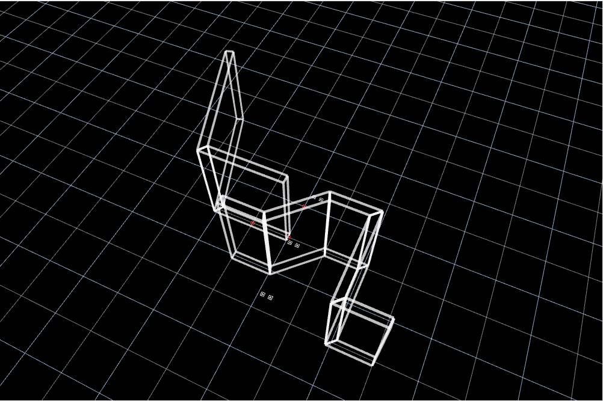
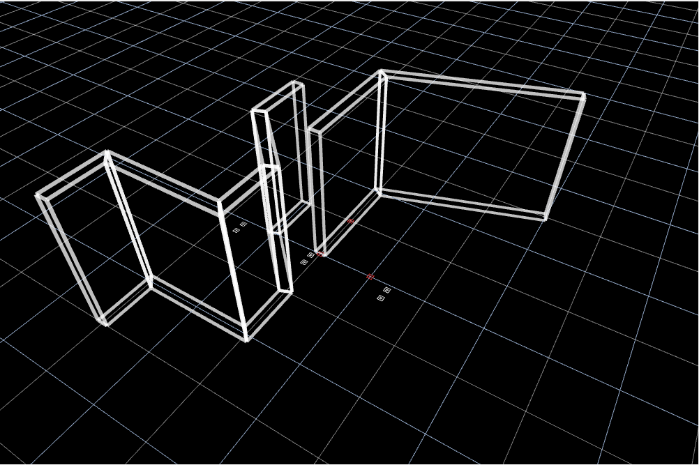

# CRAZYSWARM APPLICATION (ROS2)

Crazyswarm application layer, which provides a **path planning layer** to reach desired setpoints, **apriltag detection** for relocalization to global map and static and reciprocal avoidance and on-user commands. Also included capability, to "allocate" themselves to targets as seen below.

* This package was tested on `ROS-Galactic Ubuntu 20.04`.

## Simulation Example


## Real Life Relocalization Example


## Obstacles simple polygon generation
| Perspective1 | Perspective2 |
| :---: | :-----------: |
|  |  |

## Important Dependencies
1. [For relocalization] `gtsam` at https://github.com/borglab/gtsam using version 4.1.1
2. [For reciprocal avoidance] `kdtree` to organize agents into a kdtree
3. [For reciprocal avoidance] `orca` has been taken from `agent.c` and `agent.h`and heavily modified to work with this module (making it more of a standalone) https://github.com/snape/RVO2-3D
4. [For static avoidance] `3dvg` for visibility graph planning in structured environment https://github.com/matthewoots/3dvg
5. [Crazyflie firmware for mellinger velocity control] `crazyflie-firmware` at my fork https://github.com/matthewoots/crazyflie-firmware
6. The rest of the additional modules below are forks since there are modifications I have done to make them work with this module

## Environment Setup and Compilation
1. Create workspace
```bash
cd <to-your-preferred-directory>
mkdir -p crazyswarm2_ws/src
cd <to-your-preferred-directory>/crazyswarm2_ws/src

# git clone these 6 repositories
git clone git@github.com:matthewoots/apriltag_msgs.git --branch crazyflie
git clone git@github.com:matthewoots/apriltag_ros.git --branch crazyflie
git clone git@github.com:matthewoots/crazyswarm2.git --branch crazyflie --recursive
# The motion_capture tracking has been removed, since we only need the external pose message to link up with crazyswarm2 interface
# git clone --branch ros2 --recursive https://github.com/IMRCLab/motion_capture_tracking.git
git clone git@github.com:matthewoots/crazyswarm2_application.git --recursive
git clone git@github.com:teamspatzenhirn/rviz_2d_overlay_plugins.git
```

2. Install `Apriltag` dependencies
```bash
sudo apt-get install -y \
ros-galactic-apriltag \
libboost-program-options-dev \
libusb-1.0-0-dev
pip3 install rowan
```

3. Install `gtsam` from source
```bash
#install gtsam
cd <to-your-preferred-directory>
git clone https://github.com/borglab/gtsam
cd gtsam && git checkout 4.1.1
mkdir build
cd build
cmake ..
make
sudo make install
# from here you can add the path into the library path
export LD_LIBRARY_PATH=/usr/local/lib/:$LD_LIBRARY_PATH
# or you can add it into .bashrc
```

4. Compile and source
- Be warned to deactivate `conda` env if applicable before `colcon build`
```bash
# Using your ROS2 Distribution
echo $ROS_DISTRO 
source /opt/ros/$ROS_DISTRO/setup.bash
# build
cd <location-of-crazyswarm2_ws>
# build the crazyswarm environment
colcon build --symlink-install
# source the bash file
source install/setup.bash
```

## Further Information/Help About the Package

### Mission Files
For mission files, there are various missions sample files that are in `launch/mission/*`, they are in yaml format and more information can be seen in `launch/config.yaml`. 

Launching `ros2 launch crazyswarm_application mission.py` will load the files after you have compiled and you can choose it as an input
```
user@user:~/crazyswarm2_ws$ ros2 launch crazyswarm_application mission.py
[INFO] [launch]: Default logging verbosity is set to INFO
0 .  1_agent_high.yaml
1 .  takeoff_land.yaml
2 .  1_agent_move.yaml
3 .  sample.yaml
4 .  empty.yaml
5 .  sample1.yaml
6 .  3_agent_orca.yaml
7 .  3_agent_orca_eliminate.yaml
What is your mission file?
1
Mission chosen is takeoff_land.yaml
```

### Environment
An environment consists of 2 things, obstacles and april tags, which can be used for relocalization and other task depending on usage. To create an environment: 
1. Add in a custom environment file in `launch/environment` (you can take reference to the samples
2. In `config.yaml` add in the yaml name in `environment_file` parameter

### Launch
There will need to be 4 terminals at least, to launch all the relevant packages
```bash
# 1. Launch crazyswarm server
ros2 launch crazyflie launch.py rviz:=none # Real
# or
ros2 launch crazyflie launch.py backend:=sim rviz:=none # Simulation

# 2. Launch main crazyswarm_application server
ros2 launch crazyswarm_application launch.py sim:=true # main handler node for simulation
# or
ros2 launch crazyswarm_application launch.py # main handler node for real

# 3. Launch crazyswarm_application mission file
ros2 launch crazyswarm_application mission.py # start mission

# 4. Launch crazyswarm_application visualization
ros2 launch crazyswarm_application rviz.py # visualization
```

For real life application, to activate the `relocalization` portion of this repository, `apriltag_ros` will have to be activated, this can be seen in `app_w_april.py` under the `camera_node` and `tag_node`.

### Mission Node
The mission node will evaluate the mission files that are represented by the command sequence, and the following elaborates the mission structure and content
```yaml
# Example command will be like this 
command_sequence: [
  "[1]", "[2]", "[3]", "[4]", "[5]"]
# command_sequence index
# [1] command:
#   1. takeoff = Taking off sequence
#   2. hold = Wait for certain time
#   3. goto = Move to location
#   4. goto_velocity = Move to location with velocity control
#   5. external = Wait for external command
#   6. land = Landing sequence

# [2] to wait before the next command:
#   1. conc = Go to the next command without waiting for this
#   2. wait = Wait for this command

# [3] drone number involved
#   1. "all"
#   2. "cfX" = split the cfs by underscore etc "cf1_cf2_cf3"

# [4] duration (only applicable to hold) in ms, if nothing leave empty ""

# [5] pose in XYZ "1 1 1", if nothing leave empty ""
```

For running `external modules` please refer to `launch/mission/external_sample.yaml` where the example command sequence is shown below, a timeout period is given, so that if there is no command given during a timeframe, it will be considered completed and move on to the next mission in the list 
```yaml
"external", "wait", "cf1", "", ""
```


## [Archive]
### Some test commands without crazyswarm_application
```bash
# to give a single drone go to service call without using the node
ros2 service call '/cf1/go_to' \
'crazyflie_interfaces/srv/GoTo' \
'{group_mask: 0, relative: false, goal: {x: 5, y: 1, z: 1}, yaw: 0.707, duration: {sec: 2.0, nanosec: 0}}'

# to give a single drone go to velocity service call without using the node
ros2 topic pub -r 10 '/cf1/cmd_vel_legacy' \
'crazyflie_interfaces/msg/VelocityWorld' \
'{header: {stamp: {sec: 0, nanosec: 0}, frame_id: ''}, vel: {x: 0.2, y: 0.2, z: 0.0}, yaw_rate: 0.0}'

# to give a takeoff all service call without using the node
ros2 service call '/all/takeoff' \
'crazyflie_interfaces/srv/Takeoff' \
'{group_mask: 0, height: 1.0, duration: {sec: 2.0, nanosec: 0}}'

# to give a land all service call without using the node
ros2 service call '/all/land' \
'crazyflie_interfaces/srv/Land' \
'{group_mask: 0, height: 0.0, duration: {sec: 2.0, nanosec: 0}}'

# give takeoff all command
ros2 topic pub /user crazyswarm_application/msg/UserCommand \
'{cmd: 'takeoff_all', uav_id: [], goal: {x: 0.0, y: 0.0, z: 0.0}, yaw: 0.0}' --once

# give land all command
ros2 topic pub /user crazyswarm_application/msg/UserCommand \
'{cmd: 'land_all', uav_id: [], goal: {x: 0.0, y: 0.0, z: 0.0}, yaw: 0.0}' --once

# give go_to command
ros2 topic pub /user crazyswarm_application/msg/UserCommand \
'{cmd: 'goto', uav_id: ['cf1'], goal: {x: 5.0, y: 0.0, z: 1.0}, yaw: 0.707}' --once

# give go_to command
ros2 topic pub /user crazyswarm_application/msg/UserCommand \
'{cmd: 'goto', uav_id: ['cf1', 'cf2', 'cf3'], goal: {x: 5.0, y: 0.0, z: 1.0}, yaw: 0.707}' --once
```
